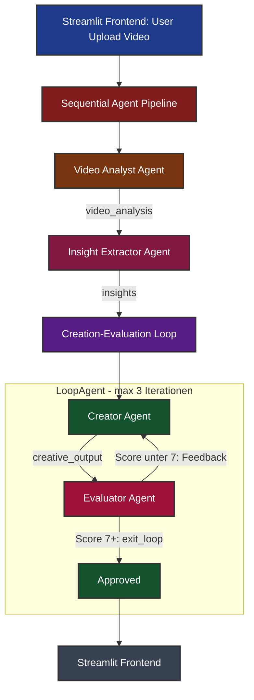

# 🚀 Social Media Agent


Ein Multi-Agenten-System basierend auf dem [InsightBench] Paper(https://arxiv.org/abs/2407.06423) und Google's [Agent Development Kit (ADK)](https://google.github.io/adk-docs/), das Social-Media-Videos analysiert und optimierte Captions & Hashtags generiert.

Das System nutzt eine **Sequential Agent Pipeline** mit einem integrierten **LoopAgent** für iterative Qualitätssicherung. Vier spezialisierte Agents arbeiten zusammen: Videoanalyse → Insight-Extraktion → Content-Erstellung → Evaluation (mit automatischer Feedback-Schleife).

## Agenten-Pipeline



### Video Analyst Agent (gemini-2.0-flash)

Extrahiert die Datenstruktur des Videos als strukturiertes Schema: Szenenlänge, Hook-Typ (erste 3 Sekunden), visuelle Frequenz und einzigartige visuelle Elemente. Formuliert **3 Root Questions** für die Retention-Optimierung.

### Insight Extractor Agent (gemini-2.0-flash)

Führt einen **Multi-Step Drill-Down** für jede Root Question durch: 4 Follow-up Questions mit Antworten, analysiert auf 4 Levels (Deskriptiv → Diagnostisch → Prädiktiv → **Präskriptiv**). Definiert Hook-Strategie und psychologischen Winkel.

### Creator Agent (gemini-2.5-pro)

Erstellt den Social-Media-Content mit **Google Search** für aktuelle Trend-Recherche. Generiert eine Caption (max 280 Zeichen) und 5 strategische Hashtags in Gen-Z Tonalität.

### Evaluator Agent (gemini-2.0-flash)

Qualitätssicherung nach dem **LLaMA-3-Eval Protokoll**: Fact-Check gegen Ground Truth, Google Search Verifikation, Rating 1-10. Bei Score < 7 gibt der Evaluator konkretes Feedback und der Creator überarbeitet (max 3 Iterationen via LoopAgent).

## Projektstruktur

```
root_agent/
├── agent.py                    # Root Agent (SequentialAgent Pipeline)
├── output_structure.py         # Alle Pydantic Output-Schemas
├── subagents/
│   ├── video_analyst_agent.py  # Agent 1: Schema Extraction & Root Questions
│   ├── insight_extractor_agent.py  # Agent 2: Multi-Step Drill-Down
│   ├── creator_agent.py        # Agent 3: Caption & Hashtag Generation
│   ├── evaluator_agent.py      # Agent 4: Quality Assurance (Rating 1-10)
│   └── creation_evaluation_loop.py  # LoopAgent (Creator + Evaluator)
├── tools/
│   ├── exit_loop.py            # Tool: Loop bei Approval beenden
│   └── engagement.py           # Tool: Gewichtete Engagement-Rate berechnen
└── test/
    ├── msg.py                  # Test-Runner (Direct Runner Mode)
    └── scenarios_test.json     # Testszenarien (4 Test Cases)
```

## Technologie-Stack

| Komponente         | Technologie                                    |
| ------------------ | ---------------------------------------------- |
| Agent Framework    | Google ADK 1.16.0 (SequentialAgent, LoopAgent) |
| LLMs               | Gemini 2.0 Flash, Gemini 2.5 Pro               |
| Output-Validierung | Pydantic Schemas                               |
| Tools              | Google Search, exit_loop, calculate_engagement |
| Frontend           | Streamlit (HTTP/SSE Anbindung an ADK Server)   |
| Paketmanager       | uv                                             |

## Ausführung

```bash
# ADK Web Interface
uv run adk web

# Streamlit Frontend (benötigt parallell laufenden ADK Server)
uv run streamlit run app.py

# Tests
uv run python root_agent/test/msg.py
```
