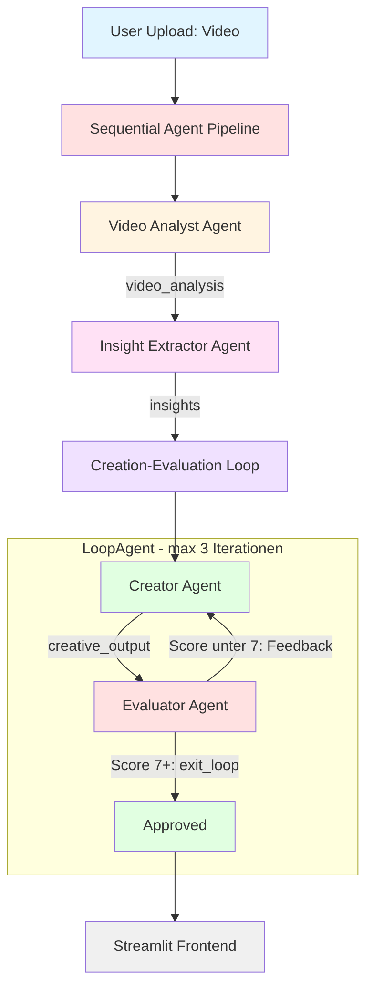

# 🚀 InsightBench: Social Media AI Booster


Ein Multi-Agenten-System basierend auf dem [InsightBench-Framework](https://arxiv.org/abs/2407.06423) und Google's [Agent Development Kit (ADK)](https://google.github.io/adk-docs/), das Social-Media-Videos analysiert und optimierte Captions & Hashtags generiert.

Dieses Projekt nutzt eine **Sequential Agent Pipeline** mit einem integrierten **LoopAgent** für iterative Qualitätssicherung. Vier spezialisierte Agents arbeiten zusammen: Videoanalyse → Insight-Extraktion → Content-Erstellung → Evaluation (mit automatischer Feedback-Schleife).

## Was du lernst

In diesem Projekt wirst du:

- Ein Multi-Agent-System mit Google ADK aufsetzen und verstehen
- Sequential Agents und LoopAgents kombinieren für komplexe Pipelines
- Daten zwischen Agents über **Output Keys** weitergeben
- Pydantic-Schemas für strukturierte Agent-Outputs verwenden
- Google Search als Tool in Agents integrieren
- Ein Streamlit-Frontend mit dem ADK-Backend verbinden (via HTTP/SSE)
- Agents mit dem ADK Eval-Framework testen

## Prerequisites

> [!IMPORTANT]
> Stelle sicher, dass `uv` installiert ist und du einen Gemini API Key hast.

- **uv** installiert. Falls nicht: [uv Installation Guide](https://github.com/kirenz/uv-setup)
- **Gemini API Key**. Erstelle einen kostenlosen Key in [Google AI Studio](https://aistudio.google.com/prompts/new_chat)

## Setup

1. Repository klonen:

```bash
git clone <repository-url>
cd test_abgabe
```

2. Dependencies installieren:

```bash
uv sync
```

3. In `root_agent/` die Datei `.env` erstellen und deinen API Key eintragen:

```env
GOOGLE_API_KEY=dein_api_key_hier
```

## Projektstruktur

```bash
test_abgabe/
├── app.py                          # Streamlit Frontend (HTTP/SSE)
├── pyproject.toml                  # Projekt-Konfiguration & Dependencies
├── root_agent/
│   ├── __init__.py                 # Package Init
│   ├── agent.py                    # Root Agent (SequentialAgent Pipeline)
│   ├── .env                        # API Keys (nicht im Git)
│   ├── output_structure.py         # Alle Pydantic Output-Schemas
│   ├── subagents/
│   │   ├── __init__.py
│   │   ├── video_analyst_agent.py  # Agent 1: Schema Extraction & Root Questions
│   │   ├── insight_extractor_agent.py # Agent 2: Multi-Step Drill-Down
│   │   ├── creator_agent.py        # Agent 3: Caption & Hashtag Generation
│   │   ├── evaluator_agent.py      # Agent 4: Quality Assurance (Rating 1-10)
│   │   └── creation_evaluation_loop.py # LoopAgent (Creator + Evaluator, max 3x)
│   ├── tools/
│   │   ├── __init__.py
│   │   ├── exit_loop.py            # Tool: Loop bei Approval beenden
│   │   └── engagement.py           # Tool: Gewichtete Engagement-Rate berechnen
│   └── test/
│       ├── msg.py                  # Test-Runner (Direct Runner Mode)
│       └── scenarios_test.json     # Testszenarien (4 Test Cases)
```

## Die Agenten-Pipeline verstehen



---

### Agent 1: Video Analyst (gemini-2.0-flash)

Extrahiert die Datenstruktur des Videos als strukturiertes Schema:

- **Scene Length**: Schnelle Cuts oder lange Takes?
- **Hook Type**: Was passiert in den ersten 3 Sekunden?
- **Visual Frequency**: Wie oft wechseln visuelle Elemente?
- **Root Questions**: 3 Kernfragen für Retention-Optimierung

### Agent 2: Insight Extractor (gemini-2.0-flash)

Führt einen **Multi-Step Drill-Down** für jede Root Question durch:

- 4 Follow-up Questions pro Root Question
- Analyse auf 4 Levels: Deskriptiv → Diagnostisch → Prädiktiv → **Präskriptiv**
- Definiert Hook-Strategie und psychologischen Winkel

### Agent 3: Creator (gemini-2.5-pro)

Erstellt den Social-Media-Content:

- **Google Search** für aktuelle Trend-Recherche
- Caption (max 280 Zeichen) + 5 strategische Hashtags
- Gen-Z Tonalität, kein "Corporate AI Speak"

### Agent 4: Evaluator (gemini-2.0-flash)

Qualitätssicherung nach dem **LLaMA-3-Eval Protokoll**:

- Fact-Check gegen Ground Truth (Video-Analyse)
- Google Search Verifikation von Claims und Hashtags
- Rating 1-10 (Default: 5, Score ≥ 7 = Approved)
- Bei Score < 7: konkretes Feedback → zurück zum Creator (Loop)

### Key Concepts

**Output Keys**: Jeder Agent speichert sein Ergebnis unter einem `output_key`. Nachfolgende Agents greifen darauf zu via `{output_key}` in ihren Instructions.

**LoopAgent**: Creator + Evaluator werden in einem `LoopAgent` gewrappt (max 3 Iterationen). Der Evaluator ruft `exit_loop` auf, wenn der Content approved ist.

**Pydantic Schemas**: Strukturierte Outputs werden über `output_schema` erzwungen (definiert in `output_structure.py`).

## Agent starten

### Option 1: ADK Web Interface

```bash
uv run adk web
```

Öffne http://127.0.0.1:8000 im Browser. Dort kannst du:

- Videos hochladen und analysieren lassen
- Events, Tracing und Artifacts inspizieren
- Den Datenfluss zwischen Agents verfolgen

### Option 2: Streamlit Frontend

```bash
uv run streamlit run app.py
```

Das Streamlit Frontend bietet:

- Video Upload mit Vorschau
- Engagement-Rechner in der Sidebar
- Tabs für Creator Output, Evaluation, Video-Analyse und Debug
- Kommunikation mit dem ADK Backend via HTTP/SSE

> [!NOTE]
> Für das Streamlit Frontend muss der ADK Server parallel laufen (`uv run adk web`).

## Tests ausführen

### Manuelle Tests (Direct Runner)

```bash
uv run python root_agent/test/msg.py
```

Führt 4 Testszenarien aus `scenarios_test.json` aus:

- TC01: TikTok Cooking Hook Analysis
- TC02: Tech Review Retention Analysis
- TC03: Travel Vlog (Vague Input Handling)
- TC04: Comedy Skit Trend Integration

## Troubleshooting

### API Key Probleme

- **"API key not valid"**: Prüfe ob der Key vollständig in der `.env` steht (keine extra Leerzeichen)
- **"GOOGLE_API_KEY not found"**: Die `.env` muss im `root_agent/` Verzeichnis liegen

### Port bereits belegt

- **"Address already in use"**: Port 8000 ist schon belegt. Alternativer Port:
  ```bash
  uv run adk web --port 8001
  ```

### Import-Fehler

- Stelle sicher, dass du Commands aus dem **Root-Verzeichnis** (`test_abgabe/`) ausführst, nicht aus Unterordnern

### UV Command Not Found

- Installiere uv: [uv Installation Guide](https://github.com/kirenz/uv-setup)
- Nach Installation ggf. Terminal neu starten
