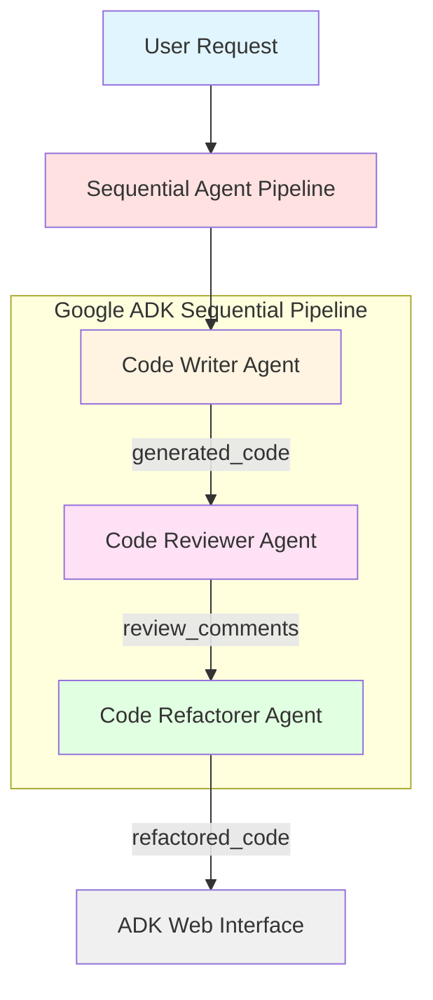

# Google Agent Development Kit (ADK) - Sequential Agent Tutorial


Google's [Agent Development Kit (ADK)](https://google.github.io/adk-docs/) is a flexible and modular framework for developing and deploying AI agents. While optimized for Gemini and the Google ecosystem, ADK is model-agnostic, deployment-agnostic, and is built for compatibility with other frameworks.


This guide shows you how to build a **Sequential Agent** in **Agent Development Kit (ADK)** for Python. Sequential agents allow you to chain multiple specialized agents together in a pipeline, where each agent performs a specific task and passes its output to the next agent. This project uses Python 3.12 (ADK requires Python 3.10 or higher).

## What You'll Learn

In this tutorial, you will:
- Set up your development environment for Google ADK
- Understand what sequential agents are and when to use them
- Create a pipeline of specialized agents that work together
- Learn how agents pass data between each other using output keys
- Build a code generation pipeline with writer, reviewer, and refactorer agents
- Interact with your sequential agent using the ADK web interface


## Prerequisites

> [!IMPORTANT]
> Before you begin, ensure you have uv installed and a Gemini API key.


- You should have `uv` installed. If you don't, follow these instructions: [uv installation guide](https://github.com/kirenz/uv-setup).

- You need a free Gemini API. Create a key in [Google AI Studio](https://aistudio.google.com/prompts/new_chat) if you haven't already.


## Steps to set up the project

Open your command line interface and change into the directory where you want to clone this repository.

Then run the following commands:

1. Clone the repository:

```bash
git clone https://github.com/kirenz/google-adk-sequential-agent.git
```

2. Change directory to the cloned repository:


```bash
cd google-adk-sequential-agent
```

3. Install the required dependencies:

```bash
uv sync
```

4. Open the project in your preferred code editor (e.g., VSCode).

5. Go to the `sequential_agent` directory and rename the `.example.env` file to `.env`

6. Open the `.env` file and add your Google API key. Save the file.


## Explore the sequential agent project

### Take a look at the project structure

The project folder `sequential_agent` has the following structure, with the `agent.py` file containing the main control code for the agent.

```bash
sequential_agent/
    agent.py      # main agent code with sequential pipeline
    .env          # API keys
    __init__.py   # package initialization
```

### Understanding the Sequential Agent Architecture



---

Open the `agent.py` file. Unlike a simple single agent, this project demonstrates a **sequential agent pipeline** with three specialized agents:

1. **Code Writer Agent**: Generates Python code based on user requests
2. **Code Reviewer Agent**: Reviews the generated code and provides feedback
3. **Code Refactorer Agent**: Improves the code based on review comments

```python
from google.adk.agents.llm_agent import Agent
from google.adk.agents.sequential_agent import SequentialAgent

GEMINI_MODEL="gemini-2.5-flash"

# Define Sub-Agents for each step of the pipeline

code_writer_agent = Agent(
    model=GEMINI_MODEL,
    name='code_writer_agent',
    description="You write Python code.",
    instruction="...",
    output_key="generated_code"  # Output passed to next agent
)

code_reviewer_agent = Agent(
    model=GEMINI_MODEL,
    name='code_reviewer_agent',
    description="You review Python code.",
    instruction="Code to Review: {generated_code}...",  # Uses previous output
    output_key="review_comments"  # Output passed to next agent
)

code_refactorer_agent = Agent(
    model=GEMINI_MODEL,
    name='code_refactorer_agent',
    description="You refactor Python code based on review comments.",
    instruction="Original Code: {generated_code} Review: {review_comments}...",
    output_key="refactored_code"
)

# Define the Sequential Agent that chains the sub-agents together
root_agent = SequentialAgent(
    name='code_pipeline_agent',
    sub_agents=[code_writer_agent, code_reviewer_agent, code_refactorer_agent],
    description="Executes a sequence of agents"
)
```

### Key Concepts

**Output Keys**: Each agent defines an `output_key` that stores its result. Subsequent agents can access these outputs using curly braces `{output_key}` in their instructions.

**Agent Chaining**: The `SequentialAgent` executes agents in order. Each agent receives the outputs from all previous agents, allowing for complex multi-step workflows.

**Specialized Roles**: By breaking down a complex task into specialized sub-agents, you create a more maintainable and effective system.

### Modify the agent pipeline

You can customize this sequential agent by:
- Adding more agents to the pipeline
- Changing the instructions for each specialized agent
- Modifying the output keys and how agents reference previous outputs
- Changing the model used for specific agents (e.g., use a more powerful model for the reviewer)

Try experimenting with different agent configurations to see how they affect the pipeline's behavior.


### Run the sequential agent in the web interface

The ADK framework provides a [web interface](https://github.com/google/adk-web) you can use to test and interact with your agent.


1. Open the integrated terminal in your code editor or use your command line interface, and run the following command from the project root directory to start the application:

```bash
uv run adk web
```

> [!NOTE]
> Run all `uv` commands from the parent directory that contains your `sequential_agent` folder. In our case, run `uv run adk web` from the `google-adk-sequential-agent` directory.


2. Open your web browser and navigate to <http://127.0.0.1:8000> to access the application.

3. You should see the ADK web interface where you can interact with your sequential agent. Try requesting: "Write a Python function that calculates the factorial of a number"

4. Watch as your request flows through the pipeline:
   - The Code Writer creates initial code
   - The Code Reviewer analyzes it and provides feedback
   - The Code Refactorer improves it based on the review

5. Explore the options at the top left to manage and test your agent like *Events*, *Tracing*, *Artifacts*, *Evaluations* and an *Agent builder assistant*. The *Tracing* view is especially helpful to see how data flows between agents.

6. To stop the application, go back to your terminal and press `Ctrl + C`.


## Troubleshooting

### API Key Issues
- **Error: "API key not valid"**: Make sure you copied the full API key from Google AI Studio without any extra spaces
- **Error: "GOOGLE_API_KEY not found"**: Verify that your `.env` file is in the `sequential_agent` directory and is named exactly `.env` (not `.example.env`)

### Port Already in Use
- **Error: "Address already in use"**: Port 8000 is already occupied. Either:
  - Stop the other application using port 8000, or
  - Use a different port: `uv run adk web --port 8001`

### UV Command Not Found
- **Error: "uv: command not found"**: Make sure uv is installed. Follow the [uv installation guide](https://github.com/kirenz/uv-setup)
- After installation, you may need to restart your terminal

### Dependencies Issues
- If you encounter dependency errors, try removing the lock file and reinstalling:
  ```bash
  rm uv.lock
  uv sync
  ```